<!-- Copy and paste the converted output. -->

>>>>>  gd2md-html alert:  ERRORs: 0; WARNINGs: 1; ALERTS: 33.

<ul style="color: red; font-weight: bold"><li>See top comment block for details on ERRORs and WARNINGs. <li>In the converted Markdown or HTML, search for inline alerts that start with >>>>>  gd2md-html alert:  for specific instances that need correction.</ul>

Links to alert messages:
<a href="#gdcalert1">alert1</a>
<a href="#gdcalert2">alert2</a>
<a href="#gdcalert3">alert3</a>
<a href="#gdcalert4">alert4</a>
<a href="#gdcalert5">alert5</a>
<a href="#gdcalert6">alert6</a>
<a href="#gdcalert7">alert7</a>
<a href="#gdcalert8">alert8</a>
<a href="#gdcalert9">alert9</a>
<a href="#gdcalert10">alert10</a>
<a href="#gdcalert11">alert11</a>
<a href="#gdcalert12">alert12</a>
<a href="#gdcalert13">alert13</a>
<a href="#gdcalert14">alert14</a>
<a href="#gdcalert15">alert15</a>
<a href="#gdcalert16">alert16</a>
<a href="#gdcalert17">alert17</a>
<a href="#gdcalert18">alert18</a>
<a href="#gdcalert19">alert19</a>
<a href="#gdcalert20">alert20</a>
<a href="#gdcalert21">alert21</a>
<a href="#gdcalert22">alert22</a>
<a href="#gdcalert23">alert23</a>
<a href="#gdcalert24">alert24</a>
<a href="#gdcalert25">alert25</a>
<a href="#gdcalert26">alert26</a>
<a href="#gdcalert27">alert27</a>
<a href="#gdcalert28">alert28</a>
<a href="#gdcalert29">alert29</a>
<a href="#gdcalert30">alert30</a>
<a href="#gdcalert31">alert31</a>
<a href="#gdcalert32">alert32</a>
<a href="#gdcalert33">alert33</a>

>>>>> PLEASE check and correct alert issues and delete this message and the inline alerts.

# Machine Reading Comprehension

# Question and Answers System for News Domain

**Final Report**

Submitted By

Sandipan Basu   Aravind Gaddala  Garima Tiwari  Pooja Chetan

 

                    Co-author**: **Sadwik Parvathaneni** **

>>>>>  gd2md-html alert: inline image link here (to images/image1.png). Store image on your image server and adjust path/filename/extension if necessary.  (<a href="#">Back to top</a>)(<a href="#gdcalert2">Next alert</a>) >>>>> 

**Post Graduate Program in Artificial Intelligence and Machine Learning**

August, 2020

[TOC]

## 1.0 Summary of problem statement, data and findings 

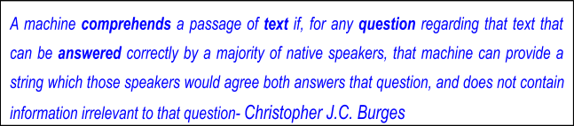

Machine reading comprehension aims to teach machines to understand a text like a human. Reading comprehension is an AI-complete task, which requires the system to process a piece of text, comprehend and be able to extract the span of text which is the answer to the user query. 

The technology is very generic and can be applied to varied domain areas, namely -

*   Help a financial consultant to ask a question given a document of his own and answer precisely as possible
*   Help to answer questions against a Legal contract document 

This project will attempt to build a Question Answering system(QnA System) in the News Domain, where Passages(Context) will be News articles, and anyone can ask a Question against it. 

For training our model, we have used the Stanford Question and Answer (SQuAD) dataset. We selected this data set since it is a closed dataset, meaning that the Answer to a Question is always a part of the Context and also a continuous span of Context. So the problem of finding an answer can be simplified as finding the start index and the end index of the context that corresponds to the answers. 

The key components of our model architecture are- Embedding Layer, RNN Layer, and the Attention Layer. We trained our models using a custom embedding layer and also using transfer learning from Google’s GloVe and the Universal Sentence Encoder. For the RNN Layer, we built variations of the RNN Layer - Vanilla LSTM Layer, Bidirectional LSTM, Stacked LSTM Layers. We built an Attention Layer using a Context to Question Attention and also improvised on the innovative Bidirectional Attention Layer. 

There has been tremendous progress in the field of NLP after the introduction of the BERT framework by Google. This achieved State-of-the-Art results on 11 individual NLP tasks. BERT has inspired many recent NLP architectures, training approaches, and language models, such as Google’s TransformerXL, OpenAI’s GPT-2, etc. We felt that the Transformer models using BERT would do a good job in addressing News domain-specific questions. Hence, we also leveraged transfer learning and built a Transformer based model using BERT.

For all the Models we evaluated the Model performance using two metrics- F1 Score and Exact Match. We concluded that the BERT model is superior in all aspects of answering various types of Questions. 

We think the model we have built has a wide application for Answering Questions from News articles and has a wide application:

*   Newsfeeds - online or offline need literacy. This system can become a foundation technology on which a voice-based question and answers can be delivered. Huge implications in rural areas and especially in times where print media is unreachable
*   This model can be extended to multilingual news question and answering system
*   Helps researchers who are mining news archives

Despite constant advances and seemingly super-human performance on constrained domains, state-of-the-art models for NLP are imperfect. These imperfections, coupled with today's advances being driven by (seemingly black-box) neural models, leaving researchers and practitioners scratching their heads asking, “why did my model make this prediction?”

For our future research, we would like to look at a few aspects to build this interpretation of model inference 

*   Interpretation of the Bilinear Term
*   Interpretation of Attention Matrix between context and question 
*   Importance of embedding, especially out of vocabulary tokens 
*   Saliency Maps explaining the model’s prediction by identifying the importance of the input tokens

## 2.0 Overview of the final process

Our goal is to create a model that takes the Passage(Context) and Query( Question) and produces an Answer. As can be seen, from a passage like the below, we can ask multiple questions whose answers mostly lie in the passage itself. 

For training our model, we have used the Stanford Question and Answer (SQUAD) dataset. More details about this data set are available [here](http://arxiv.org/abs/1806.03822), and this data set can be downloaded [here](https://rajpurkar.github.io/SQuAD-explorer/dataset/train-v2.0.json). We created a panda dataframe from the original SQuAD 2.0 dataset.

Since this is textual data, the first stage is to make the data ready for processing by the model. This Data Preparation stage for the Context and Question data involved the following steps - creation of tokenizer, conversion of text to sequences, padding of sequences, and splitting data into training, validation and test data sets.

One of our training data's important characteristics is that the Answer is always a continuous span of text in the Context. Hence, we have represented the Answer as a tuple of Answer Start Token (AS) and Answer End Token(AE)

*   AS is the position of the first answer token in the Context; and 
*   AE is the position of the last answer token in Context
*   Subject to conditions : 0 &lt;= AS, AE >= AS and AE >= m
*   ‘m’ is a parameter which has been fixed as 20. This is the maximum span for the Answer.

Our Model is composed of an Embedding Layer, RNN Layer, and an Attention Layer, followed by Bilinear Transformation step, Prediction Layer, Computing of Loss Function, Optimizer for backpropagation and Evaluation of Model.

*   **Embedding Layer**: For the Embedding Layer we have tried the following variations to test the influence on Model performance
1. Custom Embedding Layer with 100 Dimensions
2. Google’s Word2Vec Embedding with 300 Dimensions
3. Universal Sentence Encoder for English with 512 Dimensions
*   **RNN and Attention Layer**: We have built the the following algorithms to test model performance and  check Model accuracy with different parameters:
1. Baseline Model- LSTM
2. Bi-Directional LSTM
3. Stacked LSTM
4. Attention Model 

Our Benchmark Model- is the pre-trained BERT model for Question and Answer.

*   **Bilinear Transformation**: We use the Bilinear Transformation to capture the similarity between each Context Token and Question and compute the probabilities of each token being Start and End. 
*   **Prediction Layer**: The Prediction Layer outputs a prediction of Answer Start Token and Answer End Token. It does this by choosing the span of Start token and End Token such that the probability of start and end is maximised. 
*   **Loss Function**: We next have a Custom Loss function that computes the difference between the Predicted(Answer Start Token, Answer End Token) and True(Answer Start Token, Answer End Token)
*   **Optimizer**: We finally implement an Adam Optimizer as the stochastic gradient descent method. It is computationally efficient, has less memory requirement, and is capable of handling large data and parameters.
*   **Evaluation of Model:** We use two different metrics to Evaluate Model accuracy. Both metrics ignore punctuations and articles (a, an, the)- Exact match and (Macro-averaged) F1 score.

Our best performing model is the model on BERT using transfer learning. We used pre-trained models from HuggingFace and DeepPavlov. Though this is the best model that we have, this required the least amount of effort on our part. For this project we concentrated our effort on building the RNN models with the Attention mechanism, which is explained in detail in this document. 

## 3.0 Step-by-step walk through of the solution

### About Data 

For training our model, we have used the Stanford Question and Answer (SQUAD) dataset. Stanford Question Answering Dataset (SQuAD) is a reading comprehension dataset, consisting of questions posed by crowdworkers on a set of Wikipedia articles, where the answer to every Question is a segment of text, or span, from the corresponding reading passage, or the Question might be unanswerable. More details about this data set is available [here](http://arxiv.org/abs/1806.03822) and this data set can be downloaded [here](https://rajpurkar.github.io/SQuAD-explorer/dataset/train-v2.0.json). 

This data set is structured as a JSON file as below

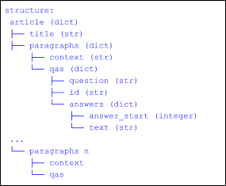

### Data Preprocessing and Preparation

    **SQuAD 2.0 Dataframe**

    We started by attempting to create a panda data frame from the original SQuAD 2.0 dataset. The code and function, which does this is detailed in the mrc-data-with-squad.ipynb Julyter notebook. While reading the raw SQuAD2.0 data, we had to keep in mind to add the is_impossible = true set of answers as well into the dataset. At the end of the data preprocessing step, we ended up with a data frame as depicted below

    

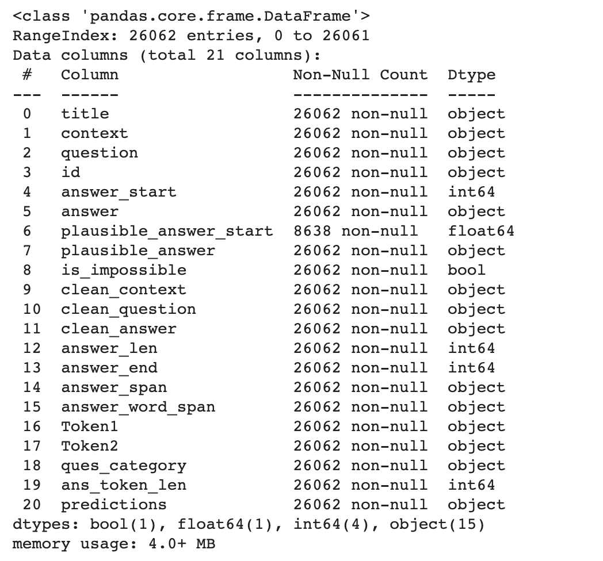

    **Normalization and Cleaning of text **

    We created common functions to clean text from the data frame. Cleaning involved removing stop words using NLTK’s stopwords dictionary. Punctuations, making all to lowercase, removal of special characters were done. This treatment is mostly done in the “context” column. Columns “question” and “answer” remained as is except for converting them to lowercase.

    Answer Token Span - Target

    The original dataset gives an answer_start column already. However, we found that this value represents a character. This machine reading comprehension is a prediction problem for detecting a span - i.e a start token and an end token. Hence we regenerated a new answer_token_span feature whose data type is a tuple, and it represents a (start, end) token position. This is the most important feature as going forward, we will see that this will be used to build our target. 

### Exploratory Data Analysis

To understand our data, we started with basic EDA using the below steps:

    **Distribution of Answerable and Unanswerable Questions**

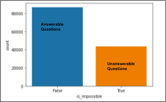

    1. _Finding_ :We found that about 33% of the questions were unanswerable.
    2. _Implication_: To do well on SQuAD2.0, any Model must not only answer Questions but also determine when the paragraph supports no answer and abstain from answering. This means that brute force methods or simple phrase matching might not perform well. We intend to evaluate model performance separately for Answerable and Unanswerable questions.

    The example below explains what is an ‘Answerable question’ and ‘Unanswerable Question’ for the given Context

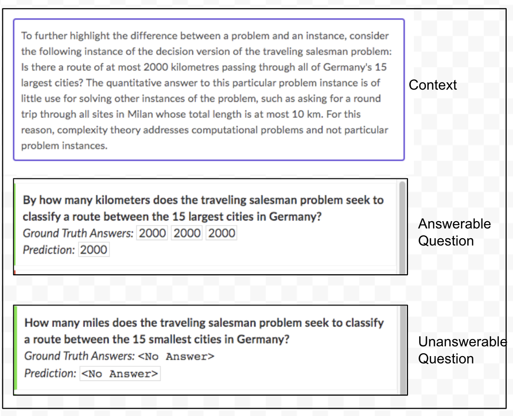
        

    **Computing the total number of words for Question, Context and Answer**

    1. _Finding_: The summary of our finding is as per the table below.  We can see that there are significant number of stop words in our features
    2. _Implication_: We intend to investigate the impact of stop words on our final model. Hence we created two different data sets- ‘Including Stop Words’ and ‘Excluding Stop words’

<table>
  <tr>
   <td>
Feature
   </td>
   <td>Total Number of Words( Average Words) including Stop Words
   </td>
   <td>Total Number of words ( Average Words) without Stop Words
   </td>
  </tr>
  <tr>
   <td>Context
   </td>
   <td><code>16000875</code>
   </td>
   <td><code>9601060</code>
   </td>
  </tr>
  <tr>
   <td>Question
   </td>
   <td><code>1311408</code>
   </td>
   <td><code>833663</code>
   </td>
  </tr>
  <tr>
   <td>Answer
   </td>
   <td><code>330366</code>
   </td>
   <td><code>262677</code>
   </td>
  </tr>
</table>

    **Computing the length for Question, Context and Answer**

    3. _Finding_: 
        *   The Minimum, Maximum and Average lengths of the Question, Context and Answer are distributed as shown in the below chart

        
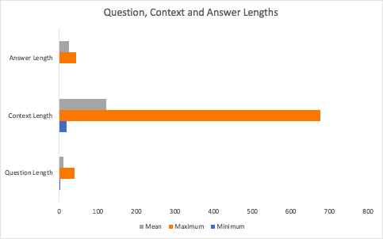

          

        *   The Frequency Distribution of the Inputs- Question Length, Answer Length and Context Length are presented below

        
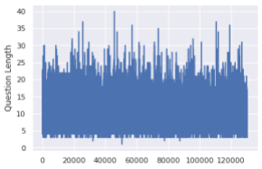
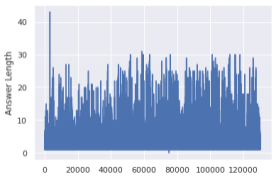
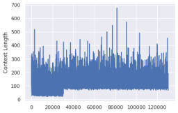

    4. _Implication: _The maximum lengths will be considered as the parameter for  padding the question and context sequences while building the model. During the evaluation stage, we will evaluate if there is any impact of answer length on the model performance metrics. 

    **N-gram Analysis for Question, Context and Answers**

1. _Finding_: Word count analysis for top 20 words for Unigram and Bigram analysis has been done. The findings are represented in the charts below.

        

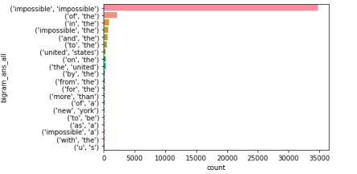

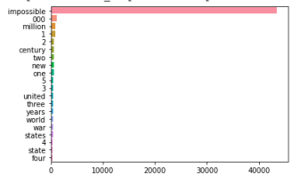

2. _Implication_: Since the vocabulary size is greater than 100,000 , no specific pattern or observation can be deduced from this analysis from this n-gram analysis.

    **Question Category Analysis**

    5. _Finding_: The Questions have been categorized as belonging to one of Eight categories- What, Who, How, When, Which, Where, Why and Whom. For questions that don't fall into any of these categories, it is categorized as ‘Others. It is observed that the majority of Questions( about 50%) are of the category _‘ What’_.

    6. _Implication: _Based on the above finding, we can expect that the questions of the _‘What’_ category will be trained much better and have much better accuracy than questions of other categories. During the evaluation stage we will analyze our model performance based on the Question category.

    **Question Category and Answer Length Analysis**

    7. _Finding: _Computing the average length of answers for different Question Categories throws up some interesting findings:
        *   Questions of Category _‘Why’_ have the highest Answer length than any other question category. This is also intuitively understandable, since questions of this ‘Why ‘category need ‘Non-Factoid’ answers- require more reasoning to _explain something. _
        *   Questions of Category ‘When’ , ‘Whom’ and ‘Which’ have relatively shorter Answer lengths. This is again intuitively understandable since these categories need ‘Factoid answer’- based

            on _facts available in the context_

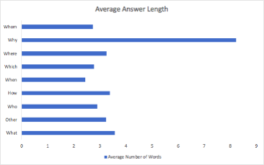

    8. _Implication: _During the evaluation stage we will analyze our model performance based on the Answer lengths.

### Model Building - SVM

## 

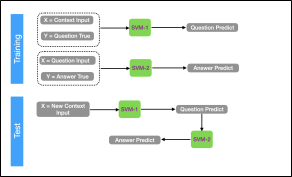

We wanted to attempt to build models using the Support Vector Machine algorithm. Our model architecture for SVM had 2 models, where -

*   Model 1 predicts a question from a context 
*   Model 2 predicts a answer given than question 

However we quickly realised that this model will not be optimal in any sense because that we have 2 features - context and question and ideally should answer from the context. We quickly found that it was difficult to even train because of below limitations - 

1. The SVM model could not be trained effectively beyond 15000 train samples. Google Colab is crashing because of an out of memory error. This is supported by the fact that the context to question the SVM model (SVM 1) file has a size of 2GB. Similar observation for the question to answer model as well. 
2. We were able to manage a single run on a very low sample size of 2000, where the train accuracy was about 94%. However it was clear that it would not be realistic to have a meaningful model out of this.
3. We had to remove and limit the tokenizer to a low number thereby increasing the chance of getting too many out of token values and hence losing a lot of language understanding.

### Model Building - Neural Network

1. Setup libraries

    We choose Tensorflow V 2.0 and Keras as the machine learning framework because of our familiarity with the framework, and it provides all the building blocks for the neural network architecture. We use google collab as the primary jupyter notebook environment, and it gives all out of the box modules installed. This saves our set up time and also helps in collaboration.

2. Build Features and Target for Model
    1. Build Train, Evaluation and Test Data

        We split our data into three data sets. We have 130306 samples in our Data set. We selected a larger size for training data since we have a complex model architecture.

        
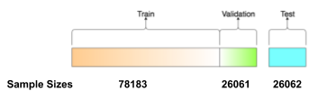

*   Training Data- The data sample that we use to fit our model
*   Validation Data- The sample of data used to provide an unbiased evaluation of model fit on training data while tuning model hyperparameters
*   Test Data- The sample of data used to provide an unbiased evaluation of the final model fit on training data.
    2. Build Target

            As explained in the Data Preparation step, the Answer in our Data is always a continuous span of text in the Context. We have represented the Answer as a tuple of Answer Start Token (AS) and Answer End Token(AE)

            *   AS is the position of the first answer token in the Context;and 
            *   AE  is the position of the last answer token in Context

      This can be visualized as following

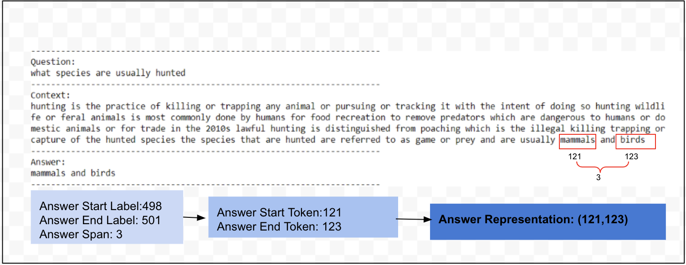

    
        We want to represent the positional index of Answer Start Token and Answer End Token so that we should be able to derive the probability of ‘Start Token’ and ‘End Token’ independently. 

        To achieve this we have to represent a Token being as a Start Token in the Context space (with a dimension of Maximum Context length). We have to do this for the End Token also. We concatenate the Start, and End Token encoded vector to represent the Target Variable. 

        This will have a dimension of [Number of Samples*(2*Max Context Length)], where [0: Max Context Length] will represent the Start Token Vector and 

        [Max Context Length+1: End] will represent the End Token Vector.

        This can be represented as follows

*   Positional Index(Answer Start Token, Answer End Token) = (11,13)

        After the encoding, we will have a sparse array with the respective Answer tokens one-hot encoded.

    3. Build Tokenizer

    We have built our tokenizer with the following parameters: 

*   Number of words= Full Vocabulary size
*   Tokenization method= Word Tokenizer
*   Lower Case= True

        We combined the texts from Contexts and Questions and Tokenized the texts. We have built three tokenizers

*   Tokenizer 1: For the data set which does not have any stop words 
*   Tokenizer 2: For the data set which has stop words
*   Tokenizer 3: BERT Tokenizer
    4. Vectorization and Encoding

    We performed the following steps as part of Vectorization and Encoding

1. Converting the context and question texts to sequences
2. Checking the maximum length of context and questions
3. We padded the context and questions to their respective maximum length to convert the sequences to the same length.This vectorization allows code to efficiently perform the matrix operations in batch during the model training.
4.  We padded using 0 and applied  ‘pre-padding’ of sequences.Since for our RNN model, we take the final output or hidden state, we would want to ensure that the memory does not get flushed out in the final step.  
3. GPU optimization \

    Our baseline LSTM model was trained on 2 vCPU. The training time for every epoch was about 3 minutes and for full 25 epochs 75 min. We realized that we have to train on GPU to reduce training times. Here are the various things we noticed and then added in the code to train on Google Colab GPU.

*   Tensorflow provides a seamless way to handle strategies to use compute devices (CPU, GPU, or TPU). We used [Strategy](https://www.tensorflow.org/api_docs/python/tf/distribute/Strategy) class with its scope() to run the all model architecture function inside GPU. This reduced the training time on the LSTM baseline to about 8 min on the full epoch. On the BlLSTM or Stacked (Deep) LSTM models, we found this reduction in hours.
*   We attempted to use the same strategy to train BERT from scratch using 1 TPU provided by Google Colab. However, we could not realize this due to time constraints, but we are sure the same code should work as-is.
*   While digging deep into making the training faster, we subscribed to PaperSpace and used their higher power VM’s with 30GB RAM and P1000 and Tesla GPUs. The performance was significantly higher than Google Colab.
*   One of the core library level changes to notice is the use of CUDNN LSTM. LSTM is poor in parallelism; hence to take full power of GPU, NVIDIA has its LSTM implementation. Tensorflow LSTM internally uses this implementation instead of when a specific set of params are used. The explanation can be found here [https://www.tensorflow.org/api_docs/python/tf/keras/layers/LSTM](https://www.tensorflow.org/api_docs/python/tf/keras/layers/LSTM)  
*   Usage of CUDNN LSTM means that either we have to use ‘post’ as padding or ignore masking. Both has its downside on model accuracy - however, we choose not to use masking and used pre-padding
*   We also attempted to train the LSTM with variable-length sequences. The idea was to avoid padding altogether hence masking. This would mean that we need to find a way to prepare batches of 1 at a time - which will invariably increase training time irrespective of what computer engine we used.
4. Hyper parameters

     The important parameters that we have used in our model architecture are detailed in the tables below

<table>
  <tr>
   <td>
Parameter
   </td>
   <td>Parameter Description
   </td>
   <td>Used in
   </td>
  </tr>
  <tr>
   <td>Context Maximum Length
   </td>
   <td>The maximum length of the context (paragraph)
   </td>
   <td>Input Layer
   </td>
  </tr>
  <tr>
   <td>Pad Sequences
   </td>
   <td>This can be ‘pre’ or ‘post’. For our model, we have used ‘pre’. We have used zeros to pad the sequences
   </td>
   <td>Embedding Layer
   </td>
  </tr>
  <tr>
   <td>Embedding Size
   </td>
   <td>Embedding size 
<ul>

<li>Custom Layer: Size=100

<li>Glove2Vec : Size=300

<li>Universal Sentence Encode: Size =512
</li>
</ul>
   </td>
   <td>Embedding Layer
   </td>
  </tr>
  <tr>
   <td>Question Maximum Length
   </td>
   <td>The maximum length of the question
   </td>
   <td>Input Layer
   </td>
  </tr>
  <tr>
   <td>Memory Size of RNN Units
   </td>
   <td>The memory size of the LSTM. We have used 256 for our model
   </td>
   <td>LSTM Layer
   </td>
  </tr>
  <tr>
   <td>Vocabulary Size
   </td>
   <td>The total vocabulary size. This is 100850
   </td>
   <td>Embedding Layer
   </td>
  </tr>
  <tr>
   <td>Training Data Shape
   </td>
   <td>Dimensions of Training Data:78183X16
   </td>
   <td>Input Layer
   </td>
  </tr>
  <tr>
   <td>Validating Data Shape
   </td>
   <td>Dimensions of Validation Data:26061X16
   </td>
   <td>Input Layer
   </td>
  </tr>
  <tr>
   <td>Testing Data Shape
   </td>
   <td>Dimensions of Validation Data:26062X16
   </td>
   <td>Input Layer
   </td>
  </tr>
  <tr>
   <td>Masking
   </td>
   <td>Whether the padded zeros have to be masked(hidden) while building Embedding Matrix
   </td>
   <td>Embedding Layer
   </td>
  </tr>
  <tr>
   <td>Weights
   </td>
   <td>Weights for the Embedding Layer- Use from Embedding Matrix or from Tokenizer
   </td>
   <td>Embedding Layer
   </td>
  </tr>
  <tr>
   <td>Trainable
   </td>
   <td>Whether to train the Embedding Layer- Value is False in case of GloVe Embedding and Universal Sentence Encoder
   </td>
   <td>Embedding Layer
   </td>
  </tr>
  <tr>
   <td>Return State
   </td>
   <td>This is a Boolean value. Whether to return the last state in addition to the output.Default value is False.
   </td>
   <td>LSTM Layer
   </td>
  </tr>
  <tr>
   <td>Return Sequences
   </td>
   <td>This is a Boolean value. Whether to return the last output in the output sequence or the full sequence.Default value is False.
   </td>
   <td>LSTM Layer
   </td>
  </tr>
  <tr>
   <td>Token Span
   </td>
   <td>The length between the start token and end token. Integer Value 
   </td>
   <td>Prediction Layer
   </td>
  </tr>
  <tr>
   <td>Number of Epochs
   </td>
   <td>The number of epochs for the model training
   </td>
   <td>Model Training
   </td>
  </tr>
  <tr>
   <td>Training Batch Size
   </td>
   <td>Number of training samples to be used in one iteration
   </td>
   <td>Model Training
   </td>
  </tr>
  <tr>
   <td>Length of Training Data
   </td>
   <td>The number of samples in training data
   </td>
   <td>Model Training
   </td>
  </tr>
  <tr>
   <td>Length of Validation Data
   </td>
   <td>The number of samples in validation data
   </td>
   <td>Model Training
   </td>
  </tr>
  <tr>
   <td>Length of Test Data
   </td>
   <td>The number of samples in test data
   </td>
   <td>Model Training
   </td>
  </tr>
  <tr>
   <td>Number of Training Steps
   </td>
   <td>(Length of Training Data)/Training Batch Size
   </td>
   <td>Model Training
   </td>
  </tr>
  <tr>
   <td>Validation Batch Size
   </td>
   <td>Number of validation samples to be used in one iteration
   </td>
   <td>Model Training
   </td>
  </tr>
  <tr>
   <td>Number of Validation Steps
   </td>
   <td>(Length of Validation Data)/Batch Size
   </td>
   <td>Model Training
   </td>
  </tr>
  <tr>
   <td>Save Weights only
   </td>
   <td>If True, only the Model’s weights are Saved, else the full model is saved.
   </td>
   <td>Model Check point
   </td>
  </tr>
  <tr>
   <td>Monitor
   </td>
   <td>Quantity to monitor during Training- Validation Accuracy
   </td>
   <td>Model Check point
   </td>
  </tr>
  <tr>
   <td>Mode
   </td>
   <td>Can be Auto, Min or Max. Since we are monitoring Validation Accuracy we have selected ‘Max’.
   </td>
   <td>Model Check point
   </td>
  </tr>
  <tr>
   <td>Save Best
   </td>
   <td>If True, the latest best model as per the quantity monitored will not be overwritten
   </td>
   <td>Model Check point
   </td>
  </tr>
  <tr>
   <td>Filepath
   </td>
   <td>The file path to save the model
   </td>
   <td>Saving the Model
   </td>
  </tr>
  <tr>
   <td>Overwrite
   </td>
   <td> If True, it will overwrite an existing Model
   </td>
   <td>Saving the Model
   </td>
  </tr>
  <tr>
   <td>Include Optimizer
   </td>
   <td> If True, save the Optimizer’s state together with the Model
   </td>
   <td>Saving the Model
   </td>
  </tr>
  <tr>
   <td>Save_format
   </td>
   <td> Saved as h5 format
   </td>
   <td>Saving the Model
   </td>
  </tr>
</table>

5. Model Architecture 

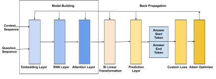

    5. Input Layer

        The inputs to our model are the padded sequences of Question and Context. The shape of the input sequences:

*   Question Sequence =  (Vocabulary Size*Max Length of Question Sequence) 
*   Context Sequence = (Vocabulary Size*Max Length of Context Sequence)
    6. Embedding Layer

        We added an Embedding layer for creating word vectors for our Question and Context text sequences. This layer sits between the Input Layer and the RNN Layer. 

*   Inputs to ‘Question’ Embedding Layer- ( Number of Samples*Max Question Length)
*   Inputs to ‘Context’ Embedding Layer- ( Number of Samples *Max Context Length)

        The output of the Embedding Layer are vectors of shape 

*   Output of Question Embedding Vector: ( Training Sample Size*Max Length of Question X Embedding Size)
*   Output of Context Embedding Vector: ( Training Sample Size*Max Length of Context X Embedding Size)

        We have used two approaches for building the Embedding Layers for the models

1. _Custom Embedding layer_
    *   For the _Baseline LSTM Model_, we have used a custom Embedding Layer of 100 dimensions
    *   The weights for this embedding layer were randomly initialized.
    *   The output of this embedding layer is a matrix of shape ( Vocabulary Size X 100)
2. _Transfer Learning  - GloVe Embedding and Universal Sentence Encoder_
    *   For the Bi-LSTM, Stacked LSTM and Attention Models, we used either GloVe Embedding or Universal Sentence Encoder
    *   For GloVe Embedding we used the 300 Dimension Common Crawl for the English language
    *   For Universal Sentence Encoder we used the 512 Dimension ‘universal-sentence-encoder-qa’ which shows strong performance on English language Question and Answer tasks
    *   We update each word's embedding matrix in our vocabulary that we created using the tokenizer from the previous step. 
    *   We use the weights learned from this Embedding Matrix for our Embedding layer.
    *   In the case of transfer learning, this layer is not trained- Trainable=’False’. As explained in the section on Hyperparameters, we choose Not to mask the Zeros that we used for padding our sequences. We did not create a separate token for ‘out of vocabulary words’. 
    *   
    7. RNN(LSTM) Layer

        We have built three different model architectures using RNN. 

        The input to the Question LSTM is the Question Embedding Vector, and the input to the Context LSTM is the Context Embedding Vector.

        From the Context Sequences we need the learning( features and understanding) from each cell. Hence we have the set the parameter return_sequence = True. This hidden state is not needed at each cell for the Question Sequences, hence we have set the parameter return_sequences=False.

        The output of the RNN Layer are vectors of shape 

*   The output shape of the Question LSTM Layer is ( Training Sample Size X Memory Size of RNN)
*   The Context LSTM Layer's output shape is ( Training SizeX Max Length of Context X Memory Size of RNN).

        The Hyperparameters for this layer are highlighted in Section 4.

    Model 1: Vanilla LSTM Layer

        We built a Vanilla LSTM model that has a single layer of LSTM units and an output layer.

    

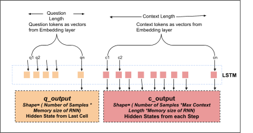  

    Model 2: Bidirectional LSTM Layer

        We built a Bidirectional LSTM model to learn the input sequences both forward and backward and concatenate the interpretations to an output layer.

        The output RNN units get doubled because of the bidirectionality of the LSTM layer.

    Model 3: Stacked LSTM Layer

        We built a Stacked LSTM layer by stacking 3 LSTM layers one on top of another.

    8. Attention Layer

        We have built an Attention Layer, which couples the Question and Context vectors and produces a set of Question aware feature vectors for each word in the Context.

        The attention layer is responsible for linking and fusing information from the Context and the Question words. The input to the Attention Layer is output from the biDirectional LSTM Layers from the Question and Context.

        Attention Layer can be built in three ways- (1) only Question to Context (2) only Context to Question; or (3) Question to Context Attention and Context to Question Attention

        We have built two different models with the following two Attention Layers:

*   Context to Question Layer ( C2Q)
*   Bidirectional Attention Layer (biDAF)- this is a combination of Question to Context Attention and Context to Question Attention

        The output of the Attention layer is the Question aware vector representations of the Context words. The shape of this Attention Vector is ( Number of Samples* Max Context Length * 2(Number of RNN Units))

    _Context to Question Attention Layer ( C2Q)_

        Context-to-question (C2Q) attention signifies which Question words are most relevant to each Context word. We build this layer using the following steps

*   Question LSTM output - From the Question biDirectional LSTM Layer, we need the hidden and cell states at each time step. To achieve this, we set the parameters (return_state=True) and 

        ( return_sequences=True)

*   Context LSTM output - From the Context biDirectional LSTM we get the hidden states at each time step

        ( return_sequences= True)

*   Alignment Weights - We compute the Alignment Weights through a dot product of the hidden states of the Question Vectors and Context Vectors 
*   Alignment Matrix - We derive the Alignment Matrix by inputting the alignment weights through a softmax layer. The shape of the Alignment matrix is ( Number of samples* Max Length of Context Vector*Max Length of Question Vector).We use a softmax layer to convert the weights into a set of probabilities of the Alignment weights. This helps identify the context words that are most relevant to the context words.
*   Question Attention Vector - We build the Question Vector through a dot product of the alignment matrix with the hidden states of the Question Vectors
*   Context Attention Vector - We build this by concatenating the Question Attention Vector with the Context LSTM output
*   C2Q Attention Vector - We finally build the Attention Vector by inputting the Context Attention Vector through a Dense layer with tanh activation. 

        The output of the Attention layer is the Question aware vector representations of the Context words. The shape of the Attention Vector is ( Number of Samples* Max Context Length * 2(Number of RNN Units))

            

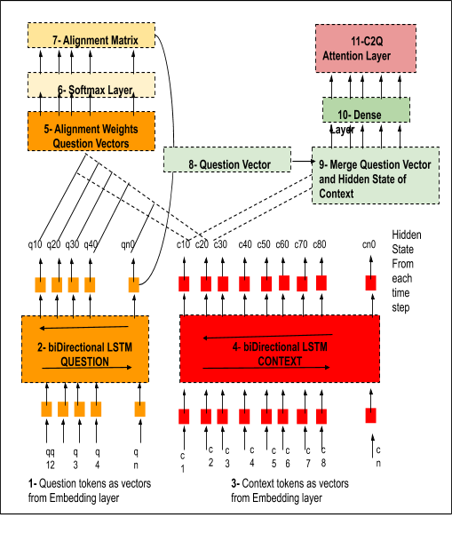_Bidirectional Attention Layer (biDAF)_- 

        We have taken inputs from this research Paper - [Bi-directional Attention Flow For Machine Comprehension](https://arxiv.org/pdf/1611.01603.pdf) as the ‘Original model’ architecture. This original model uses a hierarchical multi-stage architecture to model the representations of the context paragraph at different granularity levels. It includes character-level, word-level, and contextual embeddings, and uses bi-directional attention flow to obtain a query-aware context representation.  

        The intuition for building the biDirectional Attention Layer is that by evaluating both the similarity and relevance of each context word with the question word, the Context is more aware of the Question. 

        We have made changes to the Original model and have used only word-level embeddings. We built a combination of Question to Context Attention(Q2C) and Context to Question(C2Q) Attention Layers. C2Q attention signifies which Question words are most relevant to each Context word, and Q2C attention means which Context words have the closest similarity to one of the Question words and are hence critical for answering the query.  

        First, we model the C2Q attention layer, as described above. 

        Next, we model the Q2C attention layer. The steps for building the Q2C attention are similar to that for the C2Q attention layer. 

*   Question LSTM output - From the Question biDirectional LSTM Layer, we need the hidden and cell states at each time step. To achieve this, we set the parameters (return_state=True) and ( return_sequences=True)
*   Context LSTM output - From the Context biDirectional LSTM we get the hidden states at each time step ( return_sequences= True)
*   Alignment Weights - We compute the Alignment Weights through a dot product of the hidden states of the Question Vectors and Context Vectors 
*   Alignment Matrix- After we compute the Alignment Weights through a dot product of the hidden states of the Question Vectors and Context Vectors, we compute the ‘max score’ for the Alignment weights before passing the alignment weights through the softmax layer. This operation ensures that this step's output represents a tensor- which is the most important context word for the given question. We used the (tf.keras.backend.max) operation for this computation. This is the small difference in the modelling of this attention layer compared to the C2Q attention layer. 
*   Context Attention Vector- After we compute the Alignment matrix, we build a Context Attention Vector through a dot product of the Alignment matrix with the Context Vectors' hidden states.
*   Attention Vector- This context vector is then tiled across all context dimensions to build the Q2C Attention Layer. We used the (tf.tile) operation for this computation.
*   Bidirectional Attention Layer- the last step is to merge these two attention layers(C2Q and Q2C) to build the biDirectional Attention layer. We used the (tf.keras.layers.concatenate) operation for this merging.
    9. Bi-linearity Transformation

        We use the Bilinear Transformation to capture the similarity between each Context Token and Question. The input to the bilinear transformation layer is the output from the previous RNN Layer or Attention Layer. The output is a matrix with the probability for a token (from the Context vector) being the Start token and End token. We have referenced the methodology from the following source- https://github.com/kellywzhang/reading-comprehension/blob/master/attention.py

        We performed the following steps to model the bilinear Transformation:

*   Dense Layer- We pass the Question Vector( which is the output of the hidden state of the Question LSTM Layer) through a Dense Layer with the same number of neurons as the number of RNN Units.
*   Matrix Multiplication- We perform a matrix multiplication of the Context vector ( which is the output of the hidden state from the individual cells ) or the Attention Vector ( C2Q or combined C2Q and Q2C) with the Question vector. 
*   Add an extra dimension - Since the Question Vector is a 2-dimensional vector. In contrast, the output from the Context Vector or Attention Vector is a 3-dimensional vector; we insert an extra dimension to the Question vector. We add this dimension using tensor flow operation( tf.expand_dims). We perform this matrix multiplication along the outer dimension ( axis=2)
*   Delete the extra dimension- After the matrix multiplication operation, we delete the extra dimension that we inserted.
*   Softmax Activation We then pass the output of the matrix multiplication operation through a softmax layer. 
*   Positional Probability- We compute the positional probability for a token from the Context vector being the Start token and End token.
*   Concatenate the Probabilities- We then concatenate the start and end probabilities for a token along the inner dimension ( axis=1).

        The example below illustrates how the output from the biLinearity Transformation can be visualized and interpreted.

  

    10. Prediction Layer

        The purpose of the Prediction layer is to predict the position of two Tokens(start token and end token) in the Context Vector that together have the maximum probability of being the correct Answer for a given Question. The inputs to the Prediction Layer from the previous biLinear Transformation are the probabilities of every token in the Context being the start and end token for a given question

        We performed the following steps to model the Prediction Layer:

*   We compute the joint probability of a token being the start token and token being the end token. We do this by multiplying the probability(start_probab) of a token(Cn) with the end probability(end_probab) of all tokens upto the Span length (Cn+span). We use the (tf.matmul) operator for this step.
*   We use a hyperparameter - ‘Span Length’ to control the span for this computation. This span is the number of words between the Start and End token. We have used a Span of 20, since that is the average answer length based on the data analysis.
*   Since the previous step computes the joint probability between all the tokens in the context (C1..Cn), we must apply a condition that the Start token position must be before the End token. Any combination of tokens and their probabilities that do not satisfy this criteria are considered as invalid. (We use the (tf.linalg.band_part) operator to do this. We construct a similarity matrix ( context lengthX context length). This can be visualized as below

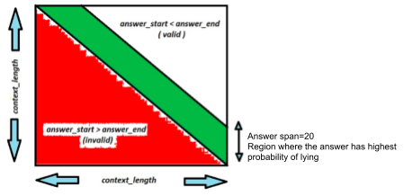

            Since Answer End Token > Answer End Token, the correct answer will always be in the matrix's upper part.

*   Finally, we output the probability ( Y_probab) as a concatenation of the start and end positional token probabilities. 
*   From the above (Y_probab) to the actual value of Y_predict happens outside the model. We expect that to happen at the time of inference. We use the argmax function on our Y_probab, thereby getting a final array of Y_predict having the same dimension of Y_probab and being a sparse matrix with the predicted answers one-hot encoded. 
*   This can be understood using the following example. 
*   Consider Y_Probab Values are as below

            

*   In the above example, the highest probabilities are when the Start Token is C11 and End Token is C13. The case where the start token is C12 and end token is C10 is invalid, because this would lie in the lower part of the matrix(as explained above).
*    The Y_predict will be as encoded as below as a sparse matrix with the token 11 and token 13, converted to one-hot encoding.This is computed using the argmax function based on the highest occurring probabilities for the start and end token independently.

             

    11. Custom Loss Function

        The custom loss function(logits_loss) computes the loss between the Predicted(Y_predict) and True values(Y_true). Since both these are encoded as a combination of Start and End tokens parameters, we compute the loss for the Start token and End tokens separately. To compute the loss, we use the operator (tf.keras.backend.categorical_crossentropy). 

        After we obtain the loss for start token and end token values, we sum them to compute the Total loss.

    12. Model Compilation and Summary

        We compile our model using the following parameters.

*   Optimizer= ‘Adamax’ for gradient descent. It is a variant of Adam based on the infinity norm. We have selected Adamax as it is sometimes superior to Adam, especially in models with embeddings as per this Research - https://arxiv.org/pdf/1412.6980.pdf
*   Loss= logits_loss. This is the custom loss function that we have computed, as explained in the earlier step
*   Metrics=accuracy. This computes the frequency with which Y_predict matches Y_true. 

        We print the model architecture using the model.summary method. The inputs to this are the Question and Context Embeddings, and the output is the Prediction (Y_predict) 

 

    13. Model Training
*   We train our model using the hyperparameters mentioned in the Section on ‘Hyperparameter’. 
*   We built a Data generator function which takes batches of data for training our model.
*   We implement a model call back function to check the Accuracy at the end of every epoch. 
*   We finally save the model along with the weights for the Optimizer.

## 4.0 Model Evaluation

### List of All Models

As is explained in the overview process we have during this Capstone project, we have evaluated 11 models in total. Types of models are as described below - 

1. Machine Learning based - Support Vector Machine 
2. Recurrent Neural Network based 
3. Transformer based with transfer learning 

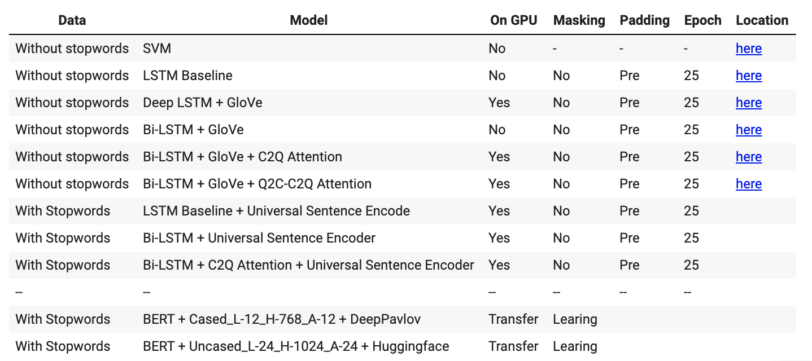

### Evaluation Metrics 

As part of our model evaluation effort, we took inspiration from the official SQuAD evaluation script hosted [here](https://worksheets.codalab.org/rest/bundles/0x5d2ee15e3f2d4e34bb864df4955274e8/contents/blob/evaluate.py). The F1 score metrics from sklearn package is not sufficient to evaluate a QnA machine reading comprehension system. 

Let's take an example to look as to why it will be erroneous in this case to use sklearn’s accuracy metrics. Let's consider the following questions and gold answers given for a context.

It's possible that the predicted answer of question 1 could be - “Balaram Bhargava” instead of “Dr Balaram Bhargava” or that of question 2 is simple “1990” instead of “1990 new cases”. In such cases, sklearn F1 metrics will fail to match, resulting in drawing a wrong conclusion. The custom F1 and exact match function rely on the match of common tokens. An overview is presented [here](https://docs.google.com/document/d/1xO8S1qdl9LGydO7B7kXLTNeg0-5PYeIXIAVKaYW-52Q/edit?ts=5f0dc3bf#bookmark=id.56j3ldcoqqxu). 

<table>
  <tr>
   <td>Exact Match Score
   </td>
   <td>
<ol>

<li>Normalize the texts - both gold and predicted answers

<li>Do an exact match 

<li>In case of matching of “plausible answer” feature with prediction values - we will ignore all empty string matches 
Refer to  of mrc_Evaluations.ipynb for details - 

compute_exact(a_gold, a_pred, type='a')
</li>
</ol>
   </td>
  </tr>
  <tr>
   <td>F1 Score
   </td>
   <td>
<ol>

<li>Normalize the texts - both gold and predicted answers

<li>Get unique tokens for each

<li>Get the common tokens between gold and predicted answers

<li>Precision is giving by the formula                         Precision = 1.0 * num_same / len(pred_toks)

<li>Recall is giving by the formula                                     Recall = 1.0 * num_same / len(gold_toks)

<li>F1 score hence is giving by                                                F1 =(2*precision*recall)/(precision+recall)
Refer to  of mrc_Evaluations.ipynb for details - 

def compute_f1(a_gold, a_pred,  type='a')
</li>
</ol>
   </td>
  </tr>
</table>

If we now try to build a table of true versus predicted values, we show that the custom F1 and custom EM function is valuable and needed for evaluations and of course outperforms the sklearn built in methods.

<table>
  <tr>
   <td>Gold Answer
   </td>
   <td>Predicted Answer
   </td>
   <td>sklearn F1 (macro)
   </td>
   <td>Custom F1
   </td>
   <td>String EM
   </td>
   <td>Custom EM
   </td>
   <td>Comments
   </td>
  </tr>
  <tr>
   <td>by marriage through coburgs
   </td>
   <td>by marriage through the Coburgs
   </td>
   <td>0
   </td>
   <td>1
   </td>
   <td>0
   </td>
   <td>1
   </td>
   <td>Normalize text and removes stop words 
   </td>
  </tr>
  <tr>
   <td>Dr Balaram Bhargava
   </td>
   <td>Balaram Bhargava
   </td>
   <td>0
   </td>
   <td>0.8
   </td>
   <td>0
   </td>
   <td>0
   </td>
   <td>“Dr” is not a stop word but this gets caught in F1 score
   </td>
  </tr>
  <tr>
   <td>1990 new cases
   </td>
   <td>1990
   </td>
   <td>0
   </td>
   <td>0.5
   </td>
   <td>0
   </td>
   <td>0
   </td>
   <td>
   </td>
  </tr>
</table>

### Evaluation Datasets

    **Test Dataset**

    We created a train, evaluation, and test data set from SQuAD’s main dataset itself. 

<table>
  <tr>
   <td>Original Data Set
   </td>
   <td>130306 samples
   </td>
  </tr>
  <tr>
   <td>Train set
   </td>
   <td>78183 samples
   </td>
  </tr>
  <tr>
   <td>Eval dataset
   </td>
   <td>26061 samples
   </td>
  </tr>
  <tr>
   <td>Test dataset
   </td>
   <td>26062 samples
   </td>
  </tr>
</table>

    We see that typical data distribution of various types of questions remains similar across the datasets showing no imbalance in training a specific kind of question.

    
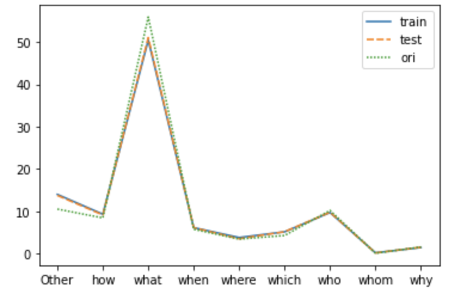

    **bAbI tasks **

    Choosing the right evaluation metrics for a Question-Answering system in NLP would be a pivotal component to evaluate the model's performance. We attempted to use toy sample tasks based on Facebook’s bAbI’s question answer generator and evaluation and attempts to provide a somewhat realistic measure of models performance on these typical NLP QnA tasks

    
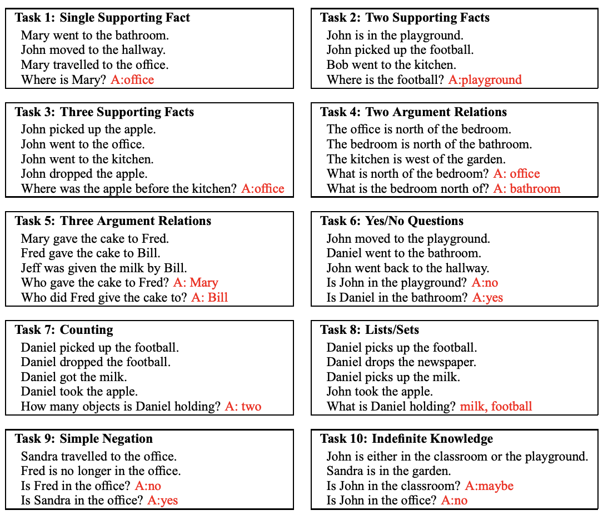

    
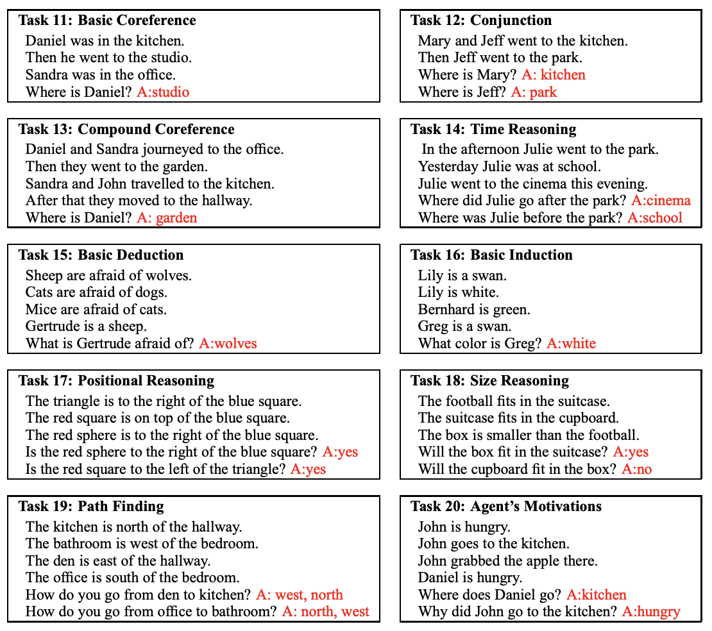

    While we had full intention to do an evaluation of our top 2 models against this dataset, due to lack of time, this could not be completed. However, as can be seen in this [Jupyter notebook](https://colab.research.google.com/github/sandipanbasu/aiml-capstone/blob/master/mrc_Evaluations.ipynb?authuser=2#scrollTo=pUSShzdet2sN&line=1&uniqifier=1) an attempt was made to arrive at this.

    **News Domain dataset**

    This Capstone project tries to build a machine reading comprehension system which answers the News domain correctly. We realized that we might have to train the language models on the News domain-specific dataset, and we proposed to use CNN and DailyMail data sets. However, once we started working on the CNN dataset, we realized that the CNN dataset is a cloze style dataset where the prediction is missing words in a sentence. We also realized that it would be relatively simple to extend our RNN model architecture to adapt to the cloze test. The change that is needed is depicted in the below extract - 

    “Since each answer in the CNN/DailyMail datasets is always a single word (entity), we only need to predict the start index (p1 ); the prediction for the end index (p2 ) is omitted from the loss function. Also, we mask out all non-entity words in the final classification layer so that they are forced to be excluded from possible answers. Another important difference from SQuAD is that the answer entity might appear more than once in the context paragraph. To address this, we follow a similar strategy from Kadlec et al. (2016). During training, after we obtain p1 , we sum all probability values of the entity instances in the context that correspond to the correct answer. Then the loss function is computed from the summed probability.”

    This reference is from the paper [https://arxiv.org/pdf/1611.01603.pdf](https://arxiv.org/pdf/1611.01603.pdf) . However, we decided to focus on completing the language model in its entirety instead of extending this. 

    Moreover, we felt that our transformer models on BERT would do an excellent job addressing News domain-specific questions. 

### Evaluation Results

    **Test Dataset**

    Below table shows results of all RNN and Transformer models with their scores 

    For a simpler representation if we plot a bar graph and come to a conclusion that the BERT model using transfer learning from DeepPavlov is a winner.

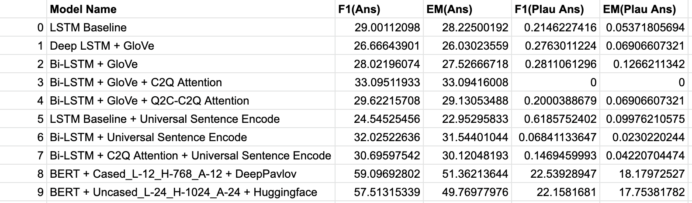

    **Question Category wise tests**

    
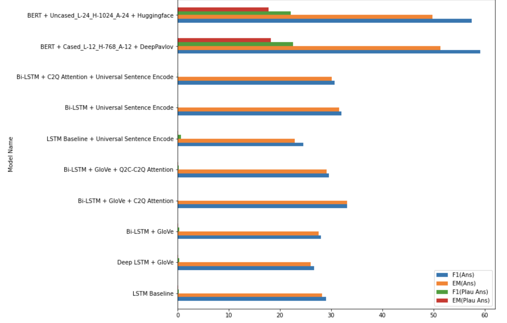

    We evaluated the model performance based on the question category. We conclude that the BERT model is superior in all aspects of answering various types of questions. 

    Please note that the BERT from HuggingFace is used for convenience as it supports TensorFlow 2.x and is easier to use in our evaluation even though BERT from DeepPavlov is 2% higher than this.

    **Answer Length wise tests**

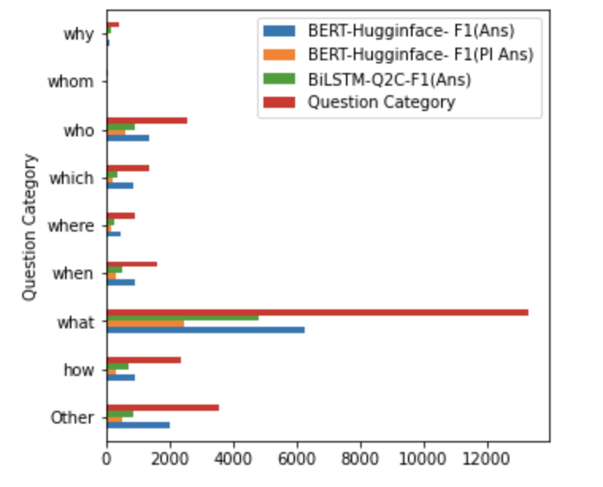

    We evaluated the model performance based on the answer length. We conclude that the BERT model is superior in answering almost all ranges of answers; however, the RNN based model can only answer lengths of 1 token. Please note that the length is in terms of tokens for example - length of “sachin tendulkar” is 2.

    **News Domain tests**

    For evaluation, we could only run a few samples of news articles against our top transformer model on BERT from Hugginface to evaluate its accuracy. The [section](https://colab.research.google.com/github/sandipanbasu/aiml-capstone/blob/master/mrc_Evaluations.ipynb?authuser=2#scrollTo=2LH06OA9sFht&line=2&uniqifier=1) and [section 2](https://colab.research.google.com/github/sandipanbasu/aiml-capstone/blob/master/mrc_Evaluations.ipynb?authuser=2#scrollTo=wIX_ati5xaM7&line=3&uniqifier=1) elaborates on our attempt. BERT is giving correct answers in all cases.

    We intended to run this against a larger data set sample, where generating the test data from the CNN dataset. However, due to time constraints, this could not be finished.

## 5.0 Comparison to benchmark

A baseline comparison of 2 metrics, one on Human Performance and another from the SQuAD 2.0 leader.

<table>
  <tr>
   <td>
   </td>
   <td>F1
   </td>
   <td>EM
   </td>
  </tr>
  <tr>
   <td>Human Performance

Stanford University

<a href="http://arxiv.org/abs/1606.05250">(Rajpurkar & Jia et al. '18)</a>
   </td>
   <td><strong>89.452</strong>
   </td>
   <td><strong>86.831</strong>
   </td>
  </tr>
  <tr>
   <td><a href="https://rajpurkar.github.io/SQuAD-explorer/">SA-Net on Albert (ensemble)</a>

<a href="https://rajpurkar.github.io/SQuAD-explorer/">QIANXIN</a>
   </td>
   <td><strong>93.011</strong>
   </td>
   <td><strong>90.724</strong>
   </td>
  </tr>
  <tr>
   <td><a href="#bookmark=id.sasgvep97kui">LSTM Baseline Model</a>
   </td>
   <td><strong>29</strong>
   </td>
   <td><strong>28</strong>
   </td>
  </tr>
  <tr>
   <td>Bi-LSTM + GloVe + C2Q Attention
   </td>
   <td><strong>33.095119</strong>
   </td>
   <td><strong>33.094160</strong>
   </td>
  </tr>
  <tr>
   <td>BERT + Uncased_L-24_H-1024_A-24 + Huggingface
   </td>
   <td><strong>57.513153</strong>

<strong>(+22.158168)</strong>[^1]
   </td>
   <td><strong>49.769780 </strong>

<strong>(+17.753818)</strong>[^2]
   </td>
  </tr>
</table>

The last 3 models are from this capstone, and as can be seen, it fails to beat the leader board. However, the BERT model, which is based on transfer learning from HuggingFace, comes closest.

There are several reasons which we think the model performance could not match the benchmarks. 

1. The model which beats human performance in SQuAD 2.0 leaderboard uses a Transformer based architecture with ensemble techniques. 2 of our models are based on RNN’s.
2. The LSTM Baseline model fails to capture language sequence information as a Transformer model does.
3. LSTM baseline mode also suffers from lack of bi-direction sequential information 
4. Using a pre-trained embedding layer on GloVe with the introduction of attention mechanism was the right next step, but we felt that it still misses on a lack of right sequence information.
5. We have used “pre” as our padding to make data sequence length the same. However, as part of our embedding layer, we had to state mask=false - indicating that padded values should not be masked. This is done to make use of [CuDNN LSTM](https://www.tensorflow.org/api_docs/python/tf/compat/v1/keras/layers/CuDNNLSTM). However, we think that model might be learning 0 as a value as well.
6. We attempted to add Attention as part of our BILSTM model. Generally, using the Attention mechanism should have given us a big boost, which we got by 4%. However, this Attention implementation is only from Context to Question.
7. We attempted a bi-directional attention model from Question to Context and Context to Question. However, we saw a reduction in accuracy. We think that the implementation of bi-DAF is not on par with benchmarks.
8. Other benchmark RNN models used a multi-embedding phase both at the phrase and character level on top of the word token level. We only could use the word level.
9. We tried using Google’s Universal Sentence Encoder, but it did not help.
10. Our epoch size on model training is 25. Other RNN benchmark models will have higher epochs
11. Hyper-parameter tuning needed more focus; we realized our learning rate parameter is not optimal. 
12. Our BERT based Transformer model, however, supersedes our RNN models by a considerable margin. However, fine-tuning the model with and maybe applying distillation in BERT could have helped.

## 6.0 Implications

Machine reading comprehension aims to teach machines to understand a text like a human. Reading comprehension is an AI-complete task, which requires the system to process a piece of writing, comprehend, and extract the span of text, which is the answer to the user query. Moreover, the question-answer is a reasonably generic task which Humans are very familiar with. Typically, we are hardwired to ask questions to an expert to get to our solutions, to acquire new information, to gather knowledge, to get help. Having a system like this that can understand information from a closed context having a general understanding of a language and then replying or explaining a question would have huge implications in any domain as long as there is information in text and sequence to sequence format. We are seeing Document AI systems using a combination of Information Retrieval and MRC systems to gain knowledge from documents. We also feel that in the more significant Artificial General Intelligence boundary, a machine reading comprehension system will definitely play in the pipeline where automatic information ingestion with understanding will be key.

This project aims to solve reading comprehension in the News domain, where Passages will be News articles, and anyone can ask a Question against it. Such a system has broad application:

*   News feeds be it online or offline needs literacy. This system can become a foundation technology on which a voice-based question and answers can be delivered. Huge implications in rural areas and specially in times where print media is unreachable
*   Multilingual news question and answering system
*   Help researchers who are mining news archives

The technology is very generic and can be applied to varied domain areas, namely -

*   Help a financial consultant to ask a question given a document of his own and answer precisely as possible
*   Help a teacher to check the answers of the student against a questionnaire in a specific subject
*   Help to answer questions against a contract document 
*   Help build a knowledge base of products from a product’s user manual and then provide quick answer for questions around it- It can be used to reply to user queries about it
*   Application in legal tech- answering questions related to various laws

## 7.0 Limitations

Our models' primary limitation is that it targets only ‘extractive answers’, where the answer is always a continuous span of text in a paragraph. Our solution does not address ‘abstractive answers’ where the answer has to be inferred based on multiple information sources. Our solution pays ‘attention’ to simple reasoning skills like locating, matching or aligning information between query and context. Many real-life situations require the answer for a question to be extracted from multiple documents and then summarized. 

To enhance our solution which should 

*   Enhance the training data size
*   Increase the variety of Training data For example:
    *    ‘Cloze style questions’ where the answer is a prediction of a missing word in a sequence; 
    *   ‘Narrative QA’, where high-level abstraction or reasoning is required to answer the questions
    *   ‘Multiple Choice Questions’ 
*   Use other Transformer and SOTA models for language modelling tasks

Apart from the above, we could also make some changes to our overall model architecture as mentioned in the ‘Comparison to Benchmark’ section.

## 

## 8.0 Closing Reflections

1. We understood the progression in Natural Language Processing from the usage of classical Machine Learning algorithms(SVM) to the State of the Art algorithms(BERT and beyond). The leaps in research and innovation that has helped in coming up with better models.
2. We could appreciate the significant role that transfer learning plays in the AI world and the NLP domain.
3. We realized that building an end-to-end NLP pipeline is much more than just using best-performing algorithms. The usage of these models at a production scale is a highly involved process.
4. Model explainability is still a big challenge, and because of these black-boxes, there could be challenges in the wide-scale adoption of some of the latest advances.
5. Much great work is happening in democratizing the access to latest research, leading to a virtuous cycle of more innovation. Huggingface is a classic example of such an open-source library.
6. To build any AI solution, we need cross-domain skills like- software engineering, data optimization, model architecture building, infrastructure, explaining machine learning, data visualization, packaging and commercialization of the solution etc.; 
7. Infrastructure( storage and processing) is a significant requirement to build some of the sophisticated models and can be a bottleneck for lay practitioners.
8. Since this is a rich domain where there are many knowledge sources available to learn from, we developed the research skills and an inquiring mindset - churn the knowledge base to identify the most relevant literature for understanding the domain and problem space; cull out the needed information to improvise and implement for our use case. 
9. We realized that even the most complex and sophisticated algorithm has its base and grounding in basics (especially matrix algebra) and statistical methods. Hence a deep understanding of these is critical for anyone who wishes to work in the domain of AI or ML. 
10. There are cross applications across different problem areas, and solutions and seemingly different domains borrow solutions from each other. A classic example is that some of the solutions devised for solving problems relating to Computer vision are also finding applicability in NLP. 

## 9.0 References

1. Pranav Rajpurkar.Robin Jia.Percy Liang. Know What You Don’t Know: Unanswerable Questions for SQuAD. [https://arxiv.org/pdf/1806.03822.pdf](https://arxiv.org/pdf/1806.03822.pdf)  
2. Danqi Chen, Adam Fisch, Jason Weston & Antoine Bordes. Reading Wikipedia to Answer Open-Domain Questions.[https://arxiv.org/pdf/1704.00051.pdf](https://arxiv.org/pdf/1704.00051.pdf)
3. Minjoon Seo, Aniruddha Kembhavi, Ali Farhadi, Hannaneh Hajishirzi. Bidirectional Attention Flow for Machine Comprehension [https://arxiv.org/abs/1611.01603.pdf](https://arxiv.org/abs/1611.01603.pdf) 
4. Raman Shinde. Neural Question And Answering Using SQAD Dataset And Attention..!!!. [https://bit.ly/3jD80oG](https://bit.ly/3jD80oG) 
5. Han Xiao - Engineering Lead @ Tencent AI Lab.Teach Machine to Comprehend Text and Answer Question withTensorflow. [https://bit.ly/2WUQdje](https://bit.ly/2WUQdje) 
6. Jacob Devlin Ming-Wei Chang Kenton Lee Kristina Toutanova. BERT: Pre-training of Deep Bidirectional Transformers for Language Understanding. [https://arxiv.org/pdf/1810.04805.pdf](https://arxiv.org/pdf/1810.04805.pdf)
7. Jay Allamar. Visualizing A Neural Machine Translation Model (Mechanics of Seq2seq Models With Attention). [https://bit.ly/3eWolBi](https://bit.ly/3eWolBi) 
8. ChrisMcCormick.Question Answering with a Fine-Tuned BERT. [https://bit.ly/301pMdC](https://bit.ly/301pMdC) 
9. NLP — Building a Question Answering model. Priya Dwivedi. [https://bit.ly/2D9lCXQ](https://bit.ly/2D9lCXQ) 
10. Xin Zhang · An Yang · Sujian Li · Yizhong Wang. Machine Reading Comprehension: a Literature Review. [https://arxiv.org/pdf/1907.01686.pdf](https://arxiv.org/pdf/1907.01686.pdf) 
11. Danqi Chen and Jason Bolton and Christopher D. Manning.A Thorough Examination of the CNN/Daily Mail Reading Comprehension Task.[https://arxiv.org/pdf/1606.02858v2.pdf](https://arxiv.org/pdf/1606.02858v2.pdf) 
12. Yuwen Zhang and Zhaozhuo Xu. BERT for Question Answering on SQuAD 2.0. [https://web.stanford.edu/class/archive/cs/cs224n/cs224n.1194/reports/default/15848021.pdf](https://web.stanford.edu/class/archive/cs/cs224n/cs224n.1194/reports/default/15848021.pdf)

# 

## 10.0 Appendix

1. GitHub - [https://github.com/sandipanbasu/aiml-capstone](https://github.com/sandipanbasu/aiml-capstone)
2. Google Drive Link - [https://drive.google.com/drive/u/2/folders/1gffRVqz342R810POEMu4pyKPMOh3z0mZ](https://drive.google.com/drive/u/2/folders/1gffRVqz342R810POEMu4pyKPMOh3z0mZ) 

<!-- Footnotes themselves at the bottom. -->
## Notes

[^1]:

     +Indicate F1 on plausible answer 

[^2]:

     +Indicate F1 on plausible answer  
